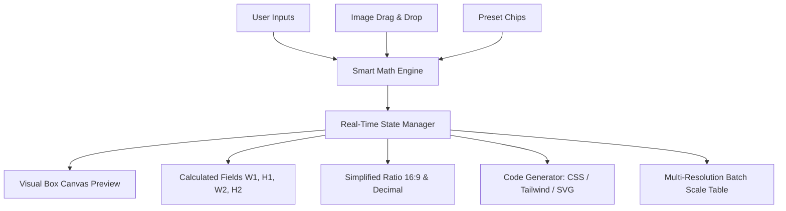

# 📐 Aspect Ratio Calculator — Competitor Analysis & Solution Architecture

## 1. Executive Summary & Problem Breakdown

### The Everyday Designer / Creator Headache
When designing banners, graphics, UI components, or social media posts:
- **Scenario**: A user has an image of **1920 × 1080** (16:9 ratio). They need to fit it into a card component on mobile with a width of **400px**.
- **Math Required**: `(1080 × 400) ÷ 1920 = 225px` height.
- **Current Frustrations**:
  1. Users shouldn't have to manually calculate ratios or open heavy software like Photoshop/Figma just to check scaled dimensions.
  2. Searching Google yields 15-year-old websites cluttered with aggressive AdSense popups, banner ads, slow load times, and clunky UI with manual "Submit/Calculate" buttons.

---

## 2. Deep-Dive Study of Existing Tools

| Tool | Strengths | Severe Flaws & UX Gaps |
| :--- | :--- | :--- |
| **`calculateaspectratio.com`** | Simple input layout | • Cluttered with heavy display ads. • Requires clicking a button to calculate. • No visual preview box. • No mobile presets (Instagram, TikTok, YouTube). |
| **`andrew.hedges.name`** | Fast loading, simple script | • Outdated 2005 HTML layout. • No visual feedback or interactive box canvas. • No fraction auto-simplifier (e.g. 1920x1080 -> 16:9). • Text-only interface. |
| **`aspectratiocalculator.com`** | Has multi-value fields | • Overloaded with banner ads on top, side, and bottom. • Cluttered page layout with massive SEO text blocks drowning out the tool. • Poor touch/mobile responsiveness. |
| **`pixexact.com`** | Includes basic presets | • Buried deep inside a tool directory with heavy UI clutter. • Confusing navigation and slow asset loading. |
| **`avtools.io`** | Clean UI for video pros | • Video-centric only (2.39:1, 16:9). • Lacks image drag-and-drop auto-detection. • No CSS code snippet generator (`aspect-ratio: 16/9`) for web developers. |

---

## 3. Core Principles of Our Solution ("RatioCraft")

To create the **fastest, most intuitive, and delightful** aspect ratio tool on the web, we adhere to 5 core design principles:

1. **⚡ Zero Latency & Zero Buttons**: Real-time bidirectional updates as you type (W1, H1, W2, H2, or Ratio).
2. **👁 Visual Live Canvas**: An interactive box that visually reflects the calculated ratio in real time, with interactive drag handles to resize visually.
3. **📁 Instant Image Auto-Detection**: Drag and drop any image file into the app — instant browser-side dimension & ratio extraction (100% offline & private).
4. **📱 1-Tap Presets Matrix**: Organized preset chips for Social Media (Instagram, TikTok, YouTube, Twitter), Display Resolutions (4K, 1080p, Ultrawide), and Print/Photography (3:2, 4:3, A4).
5. **🛠 Developer & Designer Code Export**: 1-Click copying of CSS (`aspect-ratio: 16/9;`), Tailwind (`aspect-[16/9]`), SVG code, and multi-resolution scale tables.

---

## 4. Key Feature Architecture

### Feature Details:
- **Bidirectional Lock Ratio**: Lock aspect ratio to auto-calculate height from width (or width from height). Unlock to set arbitrary dimensions and discover the simplified ratio.
- **Interactive Drag-to-Resize Canvas**: A canvas box that allows users to grab the corner handle and stretch it, continuously updating the dimensions live.
- **Batch Resolution Table**: Automatically generates 4K, 2K, 1080p, 720p, 480p, and custom mobile breakpoints from any base ratio.
- **Theme & Aesthetics**: Ultra-premium dark glassmorphic design system with vibrant gradient accents, subtle spring physics micro-interactions, clean typography, and mobile-first touch optimization.

---

## 5. Technical Implementation Roadmap

1. **Framework**: **Astro.js** (Island Architecture for 100/100 Lighthouse performance, instant loading, and top SEO ranking) + React/Vanilla JS interactive islands.
2. **Logic Engine**:
   - GCD (Greatest Common Divisor) algorithm for exact fraction simplification (e.g. `1920` & `1080` -> `16:9`).
   - Floating-point precision handling with smart rounding for clean pixel counts.
3. **Image Reader**: Browser HTML5 Canvas / `Image()` API for client-side zero-server image parsing.
4. **Keyboard Accessibility**: `Tab` navigation, `Esc` to reset, `S` to swap W & H.
